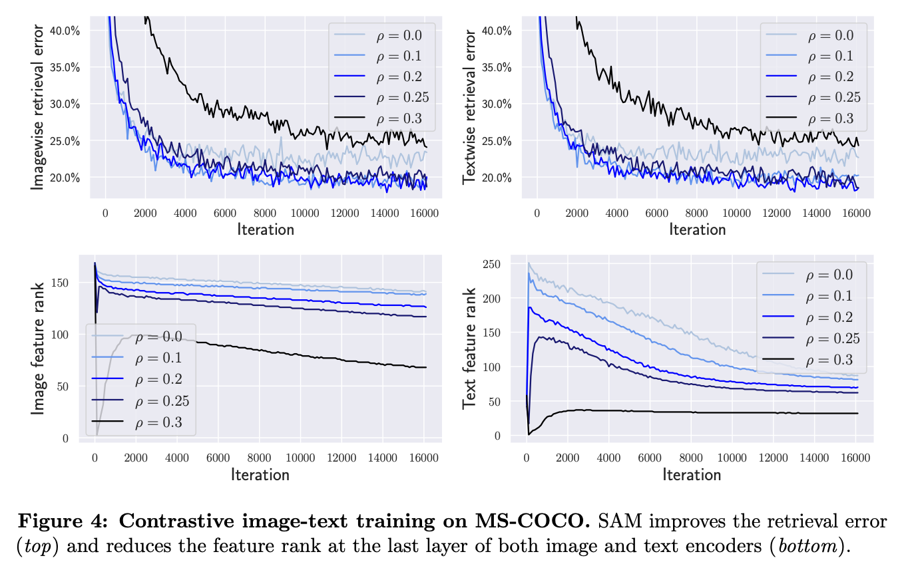

# Sharpness-Aware Minimization Leads to Low-Rank Features

**Maksym Andriushchenko (EPFL), Dara Bahri (Google Research), Hossein Mobahi (Google Research), Nicolas Flammarion (EPFL)**

**arXiv, May 2023**

**Paper:** [https://arxiv.org/abs/2305.16292](https://arxiv.org/abs/2305.16292)

<p align="center"></p>


## Abstract
Sharpness-aware minimization (SAM) is a recently proposed method that minimizes the sharpness of the training loss of a neural network. While its generalization improvement is well-known and is the primary motivation, we uncover an additional intriguing effect of SAM: reduction of the feature rank which happens at different layers of a neural network. We show that this low-rank effect occurs very broadly: for different architectures such as fully-connected networks, convolutional networks, vision transformers and for different objectives such as regression, classification, language-image contrastive training. To better understand this phenomenon, we provide a mechanistic understanding of how low-rank features arise in a simple two-layer network. We observe that a significant number of activations gets entirely pruned by SAM which directly contributes to the rank reduction. We confirm this effect theoretically and check that it can also occur in deep networks, although the overall rank reduction mechanism can be more complex, especially for deep networks with pre-activation skip connections and self-attention layers.


## Classification tasks on CIFAR-10, CIFAR-100, and Tiny ImageNet
An example of how to train models on Tiny ImageNet. First run `cd classification_task` and then run the following commands:

```bash
# Minimal setting
python train.py --dataset=tiny_imagenet --lr_max=0.05 --lr_schedule=constant --sam_rho=0.0  --model=resnet18 --model_width=64 --epochs=200 --batch_size=256 --momentum=0.0 --l2_reg=0.0 --eval_iter_freq=1000 --compute_feature_rank --exp_name=sam_low_rank_basic
python train.py --dataset=tiny_imagenet --lr_max=0.05 --lr_schedule=constant --sam_rho=0.1  --model=resnet18 --model_width=64 --epochs=200 --batch_size=256 --momentum=0.0 --l2_reg=0.0 --eval_iter_freq=1000 --compute_feature_rank --exp_name=sam_low_rank_basic
python train.py --dataset=tiny_imagenet --lr_max=0.05 --lr_schedule=constant --sam_rho=0.4  --model=resnet18 --model_width=64 --epochs=200 --batch_size=256 --momentum=0.0 --l2_reg=0.0 --eval_iter_freq=1000 --compute_feature_rank --exp_name=sam_low_rank_basic
python train.py --dataset=tiny_imagenet --lr_max=0.05 --lr_schedule=constant --sam_rho=0.5  --model=resnet18 --model_width=64 --epochs=200 --batch_size=256 --momentum=0.0 --l2_reg=0.0 --eval_iter_freq=1000 --compute_feature_rank --exp_name=sam_low_rank_basic
python train.py --dataset=tiny_imagenet --lr_max=0.05 --lr_schedule=constant --sam_rho=0.6  --model=resnet18 --model_width=64 --epochs=200 --batch_size=256 --momentum=0.0 --l2_reg=0.0 --eval_iter_freq=1000 --compute_feature_rank --exp_name=sam_low_rank_basic
```

```bash
# SOTA setting
python train.py --dataset=tiny_imagenet --lr_max=0.1 --lr_schedule=piecewise_05epochs --sam_rho=0.0  --model=resnet18 --model_width=64 --epochs=200 --batch_size=256 --momentum=0.9 --l2_reg=0.0005 --eval_iter_freq=1000 --compute_feature_rank --exp_name=sam_low_rank_augm_sota
python train.py --dataset=tiny_imagenet --lr_max=0.1 --lr_schedule=piecewise_05epochs --sam_rho=0.1  --model=resnet18 --model_width=64 --epochs=200 --batch_size=256 --momentum=0.9 --l2_reg=0.0005 --eval_iter_freq=1000 --compute_feature_rank --exp_name=sam_low_rank_augm_sota
python train.py --dataset=tiny_imagenet --lr_max=0.1 --lr_schedule=piecewise_05epochs --sam_rho=0.4  --model=resnet18 --model_width=64 --epochs=200 --batch_size=256 --momentum=0.9 --l2_reg=0.0005 --eval_iter_freq=1000 --compute_feature_rank --exp_name=sam_low_rank_augm_sota
python train.py --dataset=tiny_imagenet --lr_max=0.1 --lr_schedule=piecewise_05epochs --sam_rho=0.6  --model=resnet18 --model_width=64 --epochs=200 --batch_size=256 --momentum=0.9 --l2_reg=0.0005 --eval_iter_freq=1000 --compute_feature_rank --exp_name=sam_low_rank_augm_sota
python train.py --dataset=tiny_imagenet --lr_max=0.1 --lr_schedule=piecewise_05epochs --sam_rho=0.7  --model=resnet18 --model_width=64 --epochs=200 --batch_size=256 --momentum=0.9 --l2_reg=0.0005 --eval_iter_freq=1000 --compute_feature_rank --exp_name=sam_low_rank_augm_sota
```

Training models on CIFAR-10 and CIFAR-100 is analogous, one just has to specify `--dataset=cifar10` and `--dataset=cifar100` instead of `--dataset=tiny_imagenet`.

We note that the code has many redundancies but the evaluation of the feature rank and kNN error happens in these lines:
```python
for i in [3, 4, 5]:
    test_knn_errors += [utils_eval.compute_knn_error(train_knn_batches, test_knn_batches, model, return_block=i)]
    feature_sing_vals += [utils_eval.compute_feature_sing_vals(train_batches_large_bs_10k, model, return_block=i)] 
```


## Evaluation on ImageNet-1k
For evaluation on ImageNet-1k, run `cd contrastive_text_image_learning` and then run the following commands:
```bash
python eval_imagenet.py --return_layer=12 --split=train --n_eval_batches=100 --model_path='gs://vit_models/imagenet21k+imagenet2012/ViT-B_16.npz'  
python eval_imagenet.py --return_layer=12 --split=train --n_eval_batches=100 --model_path='gs://vit_models/sam/ViT-B_16.npz'  
python eval_imagenet.py --return_layer=12 --split=train --n_eval_batches=100 --model_path='gs://vit_models/imagenet21k+imagenet2012/ViT-B_32.npz'  
python eval_imagenet.py --return_layer=12 --split=train --n_eval_batches=100 --model_path='gs://vit_models/sam/ViT-B_32.npz'  
python eval_imagenet.py --return_layer=8  --split=train --n_eval_batches=100 --model_path='gs://vit_models/imagenet21k+imagenet2012/ViT-B_16.npz'  
python eval_imagenet.py --return_layer=8  --split=train --n_eval_batches=100 --model_path='gs://vit_models/sam/ViT-B_16.npz'  
python eval_imagenet.py --return_layer=8  --split=train --n_eval_batches=100 --model_path='gs://vit_models/imagenet21k+imagenet2012/ViT-B_32.npz'  
python eval_imagenet.py --return_layer=8  --split=train --n_eval_batches=100 --model_path='gs://vit_models/sam/ViT-B_32.npz'  
python eval_imagenet.py --return_layer=6  --split=train --n_eval_batches=100 --model_path='gs://vit_models/imagenet21k+imagenet2012/ViT-B_16.npz'  
python eval_imagenet.py --return_layer=6  --split=train --n_eval_batches=100 --model_path='gs://vit_models/sam/ViT-B_16.npz'  
python eval_imagenet.py --return_layer=6  --split=train --n_eval_batches=100 --model_path='gs://vit_models/imagenet21k+imagenet2012/ViT-B_32.npz'  
python eval_imagenet.py --return_layer=6  --split=train --n_eval_batches=100 --model_path='gs://vit_models/sam/ViT-B_32.npz' 

python eval_imagenet.py --return_layer=24 --split=train --n_eval_batches=100 --model_path='gs://vit_models/imagenet21k+imagenet2012/ViT-L_16.npz'  
python eval_imagenet.py --return_layer=24 --split=train --n_eval_batches=100 --model_path='gs://vit_models/sam/ViT-L_16.npz'  
python eval_imagenet.py --return_layer=24 --split=train --n_eval_batches=100 --model_path='gs://vit_models/imagenet21k+imagenet2012/ViT-L_32.npz'  
python eval_imagenet.py --return_layer=24 --split=train --n_eval_batches=100 --model_path='gs://vit_models/sam/ViT-L_32.npz'  
python eval_imagenet.py --return_layer=16 --split=train --n_eval_batches=100 --model_path='gs://vit_models/imagenet21k+imagenet2012/ViT-L_16.npz'  
python eval_imagenet.py --return_layer=16 --split=train --n_eval_batches=100 --model_path='gs://vit_models/sam/ViT-L_16.npz'  
python eval_imagenet.py --return_layer=16 --split=train --n_eval_batches=100 --model_path='gs://vit_models/imagenet21k+imagenet2012/ViT-L_32.npz'  
python eval_imagenet.py --return_layer=16 --split=train --n_eval_batches=100 --model_path='gs://vit_models/sam/ViT-L_32.npz'  
python eval_imagenet.py --return_layer=8  --split=train --n_eval_batches=100 --model_path='gs://vit_models/imagenet21k+imagenet2012/ViT-L_16.npz'  
python eval_imagenet.py --return_layer=8  --split=train --n_eval_batches=100 --model_path='gs://vit_models/sam/ViT-L_16.npz'  
python eval_imagenet.py --return_layer=8  --split=train --n_eval_batches=100 --model_path='gs://vit_models/imagenet21k+imagenet2012/ViT-L_32.npz'  
python eval_imagenet.py --return_layer=8  --split=train --n_eval_batches=100 --model_path='gs://vit_models/sam/ViT-L_32.npz'  

python eval_imagenet.py --return_layer=12 --split=train --n_eval_batches=100 --model_path='gs://mixer_models/imagenet1k/Mixer-B_16.npz'
python eval_imagenet.py --return_layer=12 --split=train --n_eval_batches=100 --model_path='gs://mixer_models/sam/Mixer-B_16.npz'
python eval_imagenet.py --return_layer=8  --split=train --n_eval_batches=100 --model_path='gs://mixer_models/imagenet1k/Mixer-B_16.npz'
python eval_imagenet.py --return_layer=8  --split=train --n_eval_batches=100 --model_path='gs://mixer_models/sam/Mixer-B_16.npz'
python eval_imagenet.py --return_layer=6  --split=train --n_eval_batches=100 --model_path='gs://mixer_models/imagenet1k/Mixer-B_16.npz'
python eval_imagenet.py --return_layer=6  --split=train --n_eval_batches=100 --model_path='gs://mixer_models/sam/Mixer-B_16.npz'
```


## Contrastive text image learning
To train on MSCOCO with SAM and linear bottlenecks, run `cd contrastive_text_image_learning` and then run the following commands:
```bash
python main.py --epochs=25 --lr=0.0001 --rho=0.0  --bs=128 --projection_dim=768 --run_name=unfrozen_text_long
python main.py --epochs=25 --lr=0.0001 --rho=0.1  --bs=128 --projection_dim=768 --run_name=unfrozen_text_long
python main.py --epochs=25 --lr=0.0001 --rho=0.2  --bs=128 --projection_dim=768 --run_name=unfrozen_text_long
python main.py --epochs=25 --lr=0.0001 --rho=0.25 --bs=128 --projection_dim=768 --run_name=unfrozen_text_long
python main.py --epochs=25 --lr=0.0001 --rho=0.3  --bs=128 --projection_dim=768 --run_name=unfrozen_text_long

python main.py --epochs=25 --lr=0.0001 --rho=0.0  --bs=128 --projection_dim=768 --bottleneck_dim=100 --run_name=unfrozen_text_long_bottleneck
python main.py --epochs=25 --lr=0.0001 --rho=0.0  --bs=128 --projection_dim=768 --bottleneck_dim=200 --run_name=unfrozen_text_long_bottleneck
python main.py --epochs=25 --lr=0.0001 --rho=0.0  --bs=128 --projection_dim=768 --bottleneck_dim=300 --run_name=unfrozen_text_long_bottleneck
python main.py --epochs=25 --lr=0.0001 --rho=0.0  --bs=128 --projection_dim=768 --bottleneck_dim=400 --run_name=unfrozen_text_long_bottleneck
python main.py --epochs=25 --lr=0.0001 --rho=0.0  --bs=128 --projection_dim=768 --bottleneck_dim=500 --run_name=unfrozen_text_long_bottleneck
```

To evaluate the feature ranks at different layers of a trained model:
```bash
python eval.py --split=train --return_layer=2 --n_eval_batches=10 --projection_dim=768 --model_path='/mnt/main-disk/models/lr=0.0001_rho=0.1_random_init_image=False_random_init_text=False_bottleneck_dim=-1_unfrozen_text_long'
python eval.py --split=train --return_layer=4 --n_eval_batches=10 --projection_dim=768 --model_path='/mnt/main-disk/models/lr=0.0001_rho=0.1_random_init_image=False_random_init_text=False_bottleneck_dim=-1_unfrozen_text_long'
python eval.py --split=train --return_layer=6 --n_eval_batches=10 --projection_dim=768 --model_path='/mnt/main-disk/models/lr=0.0001_rho=0.1_random_init_image=False_random_init_text=False_bottleneck_dim=-1_unfrozen_text_long'
python eval.py --split=train --return_layer=8 --n_eval_batches=10 --projection_dim=768 --model_path='/mnt/main-disk/models/lr=0.0001_rho=0.1_random_init_image=False_random_init_text=False_bottleneck_dim=-1_unfrozen_text_long'
python eval.py --split=train --return_layer=10 --n_eval_batches=10 --projection_dim=768 --model_path='/mnt/main-disk/models/lr=0.0001_rho=0.1_random_init_image=False_random_init_text=False_bottleneck_dim=-1_unfrozen_text_long'
python eval.py --split=train --return_layer=12 --n_eval_batches=10 --projection_dim=768 --model_path='/mnt/main-disk/models/lr=0.0001_rho=0.1_random_init_image=False_random_init_text=False_bottleneck_dim=-1_unfrozen_text_long'
```


## Regression with two layer networks
The exact scripts to reproduce figures are specified in `two_layer_networks/fc_nets_two_layer.ipynb`.


## Contact
Feel free to reach out if you have any questions regarding the code!

